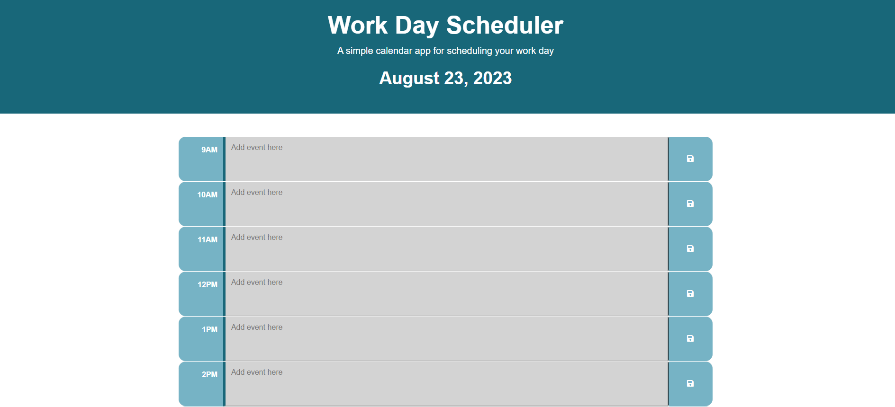

# 05-Work-Schedule

## Description

The goal for the webpage was to provide an easy way to schedule out the user's work schedule within a 9AM - 5PM shift. Through this website, the user is able to keep themselves accountable for whatever they need to get done throughout the day before the end of their shift. While making the website, I was able to better understand how jQuery and Dayjs works. I was also able to imply my knowledge of "this" statement and learn how to manipulate it into my codes.

## Table of Contents (Optional)

If your README is long, add a table of contents to make it easy for users to find what they need.

- [Installation](#installation)
- [Usage](#usage)
- [Credits](#credits)
- [License](#license)

## Installation

N/A

## Usage

Website:


Displayed on the site is the current day of the week and a timetable with the hours from 9am to 5pm. The user will notice that some tables are color coded depending on what time of day it is. Grey means it has past, red means it is current that time, and green means that it is coming up. In the timetable, the user is able to input their agenda into the textbox and save it by clicking on the save icon next to it. Once saved, the item will be stored and displayed even if the user refreshes the page so they don't lose their event. After the user is done with planning their schedule, at the bottom of the page there will be some quotes randomly displayed to provide some encouragement throughout their day.

    ```md
    
    ```

    ```md
    
    ```

## Credits

N/A

## Codes Used

The code for the challenge can be found in the following file:

- [script.js](/src/script.js): Contains the Javascript code of the landing page.

- [script.js](/src/script.js) LINE 13: Based on the work of [OpenJS Foundation and jQuery contributors](https://api.jquery.com/each/)

```
    $(".time-block").each(function() {

```

## License

N/A

## Badges

N/A

## Features

N/A

## How to Contribute

N/A

## Tests

N/A